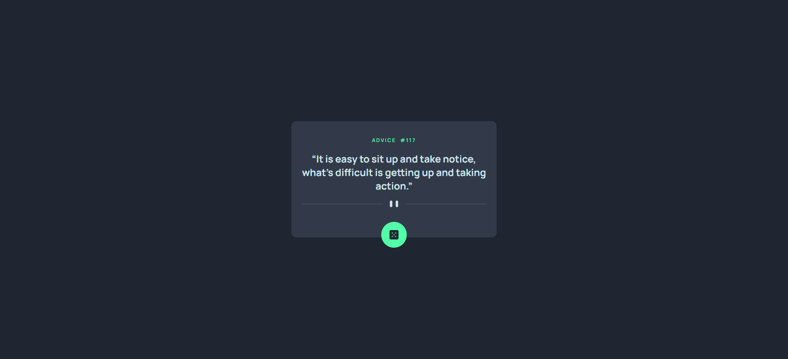
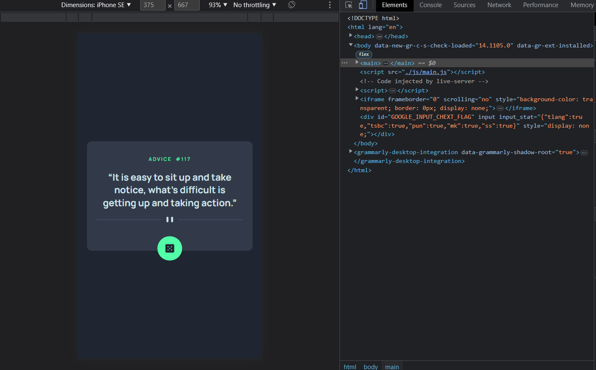

<div align="center">
  

  <h1>Frontend Mentor - Advice generator app solution</h1>
  <a href="https://advice-generator-app-287.vercel.app/"><strong>➥ Live Demo</strong></a>

</div>
<br/>


This is a solution to the [Advice generator app challenge on Frontend Mentor](https://www.frontendmentor.io/challenges/advice-generator-app-QdUG-13db). Frontend Mentor challenges help you improve your coding skills by building realistic projects.

## Table of contents

- [Overview](#overview)
  - [The challenge](#the-challenge)
  - [Screenshot](#screenshot)
  - [Links](#links)
- [My process](#my-process)
  - [Built with](#built-with)
  - [What I learned](#what-i-learned)
- [Author](#author)
- [Let's connect](#letsconnect)

## Overview

### The challenge

Users should be able to:

- View the optimal layout for the app depending on their device's screen size
- See hover states for all interactive elements on the page
- Generate a new piece of advice by clicking the dice icon

### Screenshot



<br>




### Links

- Solution URL: [Click Here](https://github.com/sudhanshu287/advice-generator-app-fm)
- Live Site URL: [Click Here](https://advice-generator-app-287.vercel.app/)

## My process

### Built with

- Semantic HTML5 markup
- CSS custom properties
- Flexbox
- Mobile-first workflow

### What I learned

I added media query with the help of javascript


```js
function imageChange(x){
    if(x.matches){
        document.querySelector('#divider').src='./images/pattern-divider-desktop.svg';
    }
}
let x=window.matchMedia('(min-width:1200px)');
imageChange(x);
x.addListener(imageChange);

```

## Author

- Website - [Sudhanshu Patel](https://sudhanshupatel.vercel.app)
- Frontend Mentor - [@Sudhanshu287](https://www.frontendmentor.io/profile/sudhanshu287)
- Linkedin - [@Sudhanshu287](https://www.linkedin.com/in/sudhanshu287)


## **Let's Connect 👋**

<div align=center id="lets-connect">

  <a href="https://sudhanshupatel.vercel.app/" target="_blank">
    
  </a>&nbsp;&nbsp;&nbsp;

  <a href="https://linkedin.com/in/sudhanshu287" target="_blank">
    
  </a>&nbsp;&nbsp;&nbsp;

  <a href="https://www.frontendmentor.io/profile/sudhanshu287" target="_blank">
    
  </a> &nbsp;&nbsp;&nbsp;

  <a href="https://www.github.com/sudhanshu287/" target="_blank">
    
  </a>

</div>